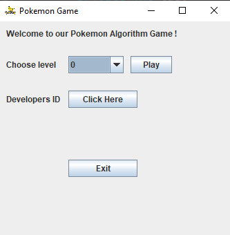

# Pokemon Algorithm Game
In our Pokemon Game the algortithm manage couple of agent, and his goal to catch as many pokemons within the time limit.

## How to play?
In our game there are 24 levels,
in each level there are different quantity of agents and a different time limit.  
Every time the agent catches a pokemon, the game creates a new pokemon on the graph.  

  
## Algorithm : 

## Package Api : 
DWGraph_Algo -  This class implements the Algorithm that runs on the agents.  
DWGraph_DS - This class implements directed weighted graph.   
EdgeData - This class implements the edge weight.

## Package gameClient :
/ToDO!  
Ex2 -   
Arena -   

## Package Gui :
Menu - This class represent the GUI Menu of the Project.

## Package Tests :
This package contains 3 tests for our game.
